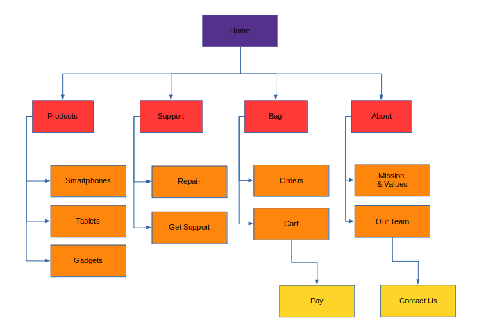

# README

## Website Map 

The Website map was designed to keep the navigation flow simple and easy for the user to access. The principal page contains a menu that allows the user to access to four principal and important pages such as:

- Products 
- Support
- Bag
- About

It is important to mantaine a simple navigatio flow for a good SEO, so this was the one important aspect kept in mind during the proccess of designing the website map.